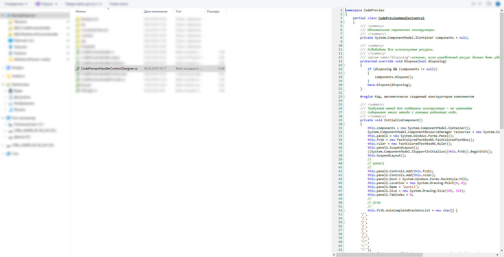

# Code Preview Handler #
The Code Preview Handler, is a preview handler for Windows Vista, 7, 8 and 10 which allows you to read your source code from explorer's preview pane

### Features ###
* Supports Windows Vista, 7, 8 and 10 on 32 and 64 bits.
* 20 source code extensions supported.

This preview handler can render the following file extensions:

Extensions | Description
------------ | -------------
.cs | C#
.vb, .vbs, .bas, .cls, .frm, .vbg | Basic (.NET, Visual and Classic)
.html, .htm, .xhtm, .xht | HTML
.xml, .xaml, .kml | XML
.sql | SQL
.php, .phtml, .pchar | PHP
.js | JavaScript
.lua | Lua

# How to install #
1. Download the latest release from [CodePreviewHandler releases on GitHub](https://github.com/reserfodium/CodePreviewHandler/releases "CodePreviewHandler on GitHub")
2. Extract it
3. Run Install.bat from the cmd.exe (with admin privileges).
4. Restart explorer.exe